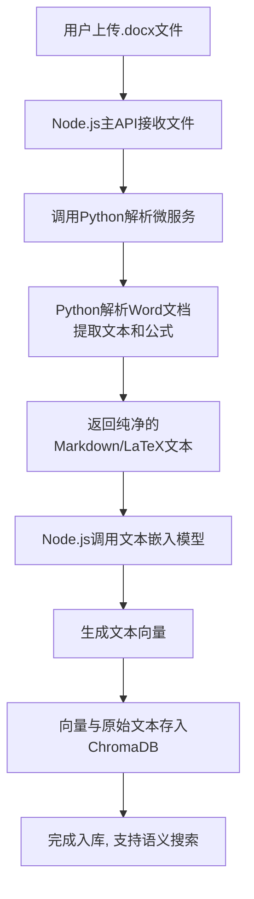

# 数学文档处理和向量存储系统

一个能够自动解析包含复杂数学公式（包括原生公式和OLE对象）的Word文档（.docx），并将解析后的内容（文本和LaTeX公式）高效存储到向量数据库中，以支持后续的语义搜索和智能检索的完整解决方案。

## 🎯 核心目标

- **输入**: 用户上传的 .docx 文件，内容为数学题目，包含文本、原生公式、OLE公式对象
- **输出**: 结构化的文本数据（Markdown/LaTeX格式），存入向量数据库，支持按数学概念和题目内容进行相似性检索

## 🏗️ 技术架构

采用 **Node.js (主API) + Python (文档处理微服务)** 的混合架构：

| 组件 | 技术选型 | 职责 |
|------|----------|------|
| 主API服务 | Node.js (Express.js) | 提供文件上传接口，协调调用Python服务，处理业务逻辑，与向量数据库交互 |
| 文档解析服务 | Python (FastAPI) | 专门负责.docx文件的深度解析，将所有类型的公式转换为LaTeX |
| 向量数据库 | ChromaDB | 存储文本和公式的嵌入向量(Embeddings)，执行相似性搜索 |
| 嵌入模型 | 文本嵌入模型 | 将文本和LaTeX代码转换为向量 |

## 📋 核心工作流程



## 🚀 快速开始

### 方式一：Docker Compose (推荐)

```bash
# 克隆项目
git clone <repository-url>
cd mathTest

# 启动所有服务
chmod +x start_services.sh
./start_services.sh
```

### 方式二：本地开发

```bash
# 启动服务（本地模式）
./start_services.sh local
```

### 服务地址

启动完成后，可以访问以下地址：

- **主服务API**: http://localhost:3000
- **Python解析服务**: http://localhost:8001
- **ChromaDB**: http://localhost:8000
- **API文档**: http://localhost:8001/docs

## 📖 API 使用说明

### 1. 健康检查

```bash
curl http://localhost:3000/health
```

### 2. 系统状态检查

```bash
curl http://localhost:3000/status
```

### 3. 上传和处理文档

```bash
curl -X POST -F "docxFile=@your-document.docx" http://localhost:3000/upload
```

### 4. 语义搜索

```bash
curl -X POST -H "Content-Type: application/json" \
  -d '{"query":"数学公式","limit":5}' \
  http://localhost:3000/search
```

## 🧪 测试工具

项目提供了完整的测试客户端：

```bash
# 安装测试依赖
pip install requests

# 健康检查
python test_client.py --health

# 上传文档
python test_client.py --file sample.docx

# 搜索文档
python test_client.py --search "二次方程"

# 查看系统状态
python test_client.py --status
```

## 📁 项目结构

```
mathTest/
├── python_service/          # Python文档解析微服务
│   ├── app.py              # FastAPI应用主文件
│   ├── requirements.txt    # Python依赖
│   └── Dockerfile         # Python服务Docker配置
├── server.js              # Node.js主服务
├── package.json           # Node.js依赖配置
├── Dockerfile.nodejs      # Node.js服务Docker配置
├── docker-compose.yml     # Docker Compose配置
├── test_client.py         # 测试客户端
├── start_services.sh      # 服务启动脚本
├── .env                   # 环境变量配置
└── README.md             # 项目说明文档
```

## 🔧 配置说明

### 环境变量 (.env)

```bash
# Node.js主服务配置
PORT=3000
NODE_ENV=development

# Python微服务配置
PYTHON_SERVICE_URL=http://localhost:8001

# ChromaDB配置
CHROMA_URL=http://localhost:8000

# 文件上传配置
MAX_FILE_SIZE=52428800
UPLOAD_DIR=uploads
```

## 🐛 故障排除

### 常见问题

1. **端口占用**
   ```bash
   # 检查端口占用
   lsof -i :3000
   lsof -i :8001
   lsof -i :8000
   ```

2. **Docker服务启动失败**
   ```bash
   # 查看日志
   docker-compose logs
   
   # 重启服务
   docker-compose down
   docker-compose up -d
   ```

3. **Python依赖安装失败**
   ```bash
   # 升级pip
   pip install --upgrade pip
   
   # 清理缓存
   pip cache purge
   ```

### 日志查看

```bash
# Docker模式
docker-compose logs -f

# 本地模式
tail -f logs/app.log
```

## 📈 性能优化建议

1. **生产环境配置**
   - 使用专业的嵌入模型（如 sentence-transformers）
   - 配置Redis缓存
   - 启用Nginx反向代理

2. **扩展性考虑**
   - 使用消息队列处理大文件
   - 实现分布式向量存储
   - 添加文档预处理队列

## 🤝 贡献指南

1. Fork 本项目
2. 创建特性分支 (`git checkout -b feature/AmazingFeature`)
3. 提交更改 (`git commit -m 'Add some AmazingFeature'`)
4. 推送到分支 (`git push origin feature/AmazingFeature`)
5. 开启 Pull Request

## 📄 许可证

本项目采用 MIT 许可证 - 查看 [LICENSE](LICENSE) 文件了解详情。

## 🔗 相关链接

- [FastAPI 文档](https://fastapi.tiangolo.com/)
- [ChromaDB 文档](https://docs.trychroma.com/)
- [python-docx 文档](https://python-docx.readthedocs.io/)
- [Express.js 文档](https://expressjs.com/)

## 📞 支持

如果你有任何问题或建议，请：

1. 查看 [Issues](../../issues) 页面
2. 创建新的 Issue
3. 联系项目维护者

---

**注意**: 这是一个演示项目，生产环境使用前请进行充分的测试和安全评估。
